<p align="center">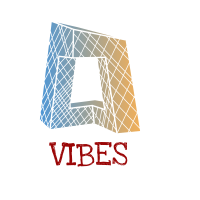</p>

# Visualization in iTowns of Buildings Elegantly Stylized

[](https://travis-ci.org/arnaudgregoire/vibes)


## Summary

1. [Introduction](#introduction)
2. [Project management](#project-management)
3. [Analysis of the existing situation](#analysis-of-the-existing-situation)
4. [Conception and development](#conception-and-development)
5. [Results](#results)
6. [Tests and deployment](#tests-and-deployment)
7. [Conclusion and perspectives](#conclusion-and-perspectives)

  ​
## Introduction

### Context  

In order to make easier the urban plans consultation process  and to implement techniques of buildings stylization in the iTowns geovisualization platform, we should adapt the architecture of iTowns to be able to integrate a process of data stylization and visualization, in the most modular and configurable way possible,therefore we need to separate the data model and the specification of the style from the rendering process itself. 

It is also necessary to implement adapted interfaces  to the parameterization of the style.

### Goals of the project

The VIBES (Visualization in iTowns of Buildings Elegantly Stylized) project consists in implementing geovisualisation techniques to stylize buildings on the platform iTowns. This project aims to provide a visual support for city planning, among other purposes.  

The user should be able to :
* Load one or several 3D file (of various formats).
* Transform its/their visual aspect(s) using a GUI.
* Save the current style in a JSON-like format (to be defined).
* Load an existing style to re-apply it, including predefined styles (transparent, typical, sketchy).  

This project was proposed by Sidonie Christophe, from the COGIT laboratory (IGN), with Alexandre Devaux and Mathieu Bredif as technical support on iTowns.

**[Back to the top](#summary)**


## Project management

This project will be carried out in March and April 2018 by a group of seven students in ENSG TSI, using SCRUM methodology. It will be divided into seven sprints, each one during a week.

### Team

The seven members of the team are :
* Houssem Adouni
* El-Hadi Bouchaour
* Arnaud Grégoire
* Rose Mathelier *(Scrum Master)*
* Laurie Nino
* Adel Ouhabi
* Ludivine Schlegel

Given the number of people in the team, it is crucial to apply an efficient orgnization so everyone can be involved. To that end, we chose to work mostly in variable pairs, and to divide the tasks each week among these pairs (one person would be working alone since we are an uneven number).  
​    
### Backlog

The previsional planning is the following :
* **Sprint 1** : analysis, conception, first version of the tool, CI/CD.
* **Sprint 2** : architecture set-up, definition of the 3D style with basic parameters + texture on faces, saving and loading.
* **Sprint 3** : adaptation of the architecture to stylize several objects, first trials on shadow management and edge texturation, analyse of exisiting situation regarding BATI3D loading in iTowns.
* **Sprint 4** : implementation of a BATI3D loader, edge stylization (dashed or continuous), basic geolocation and object movements, basic shadow management, layer management.
* **Sprint 5** : implementation of a BDTOPO loader (WFS), integration of the BATI3D loader in the project, edge texturation (sketchy style), possibility to click on objects.
* **Sprint 6** : advanced parameters including light, shadows, cameras and advanced texturation.
* **Sprint 7** : finalization, reports, presentation.  

A first previsional backlog was created at the beginning of the project.
Each friday afternoon, at the end of the sprint, we take some time for :
* a review of the work completed during the week.
* a backlog grooming to plan the next sprint and divide the tasks (usually one or two tasks per pair).
* updating the report.

### Management tools

* **GitHub** - for code hosting.
* **Travis** - for continuous integration.
* **Easybacklog** - for backlog and planning.
* **Trello** - for task assignment and file sharing.

**[Back to the top](#summary)**


## Analysis of the existing situation

### The iTowns environment

The main challenge of this project is that it has to be included into the architecture of the existing [iTowns](http://www.itowns-project.org/) project (version 2.3.0). Therefore, a necessary step is to get to know this architecture and to analyze it in order to know where our new functionalities could be located.

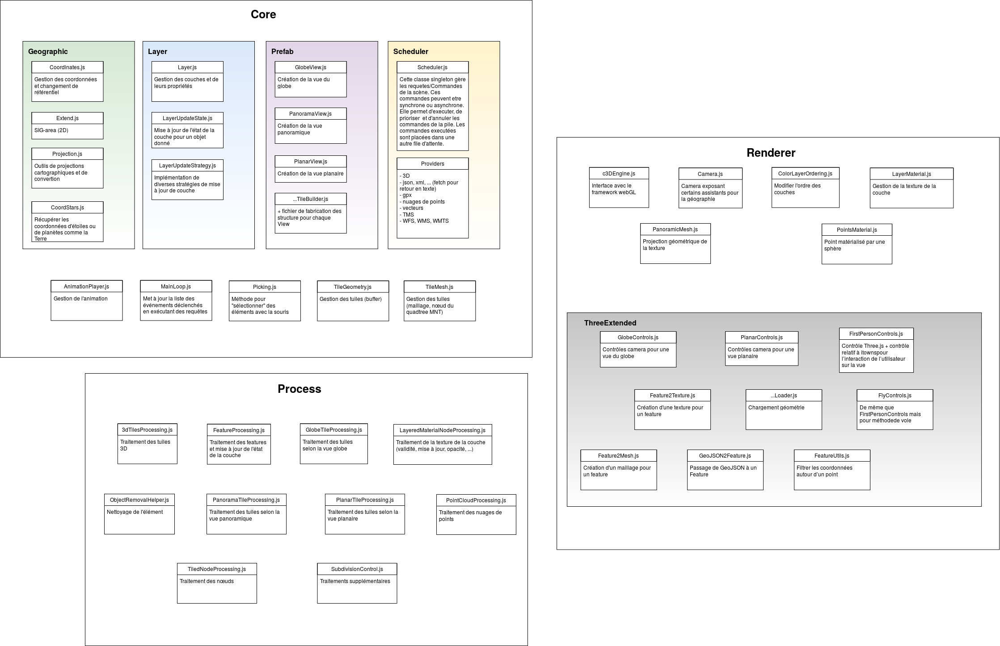

*<p align="center">legend : iTowns architecture (version du 5/03/2018).</p>*

Two sorts of development can be carried out in iTowns :

* develop a new example, based on the existing classes of the core of iTowns.
* add new functionalities directly to the core.

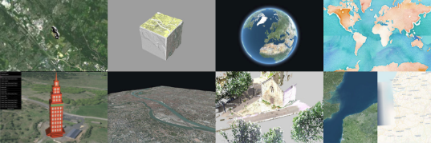

This choice depends on the purpose of the tool. Our stylization tool is intended to be applied in multiple examples, therefore the main functionalities should be integrated in the source of iTowns. This implies that they should be as generic as possible, and respect the iTowns standards. An example will also be created, only to demonstrate how our tool should be used, but the goal is to make this example as simple as possible and to avoid including too much logic in it.
​    
### PLU++

The PLU++ project, developed in 2016 by Anouk Vinesse under the supervision of Sidonie Christophe and Mickaël Brasebin (COGIT), is a tool of 3D buiding stylization using Three.js, It will be used as proof of concept to help start our project. To that end, we analyzed the code from the latest version available on github : [IGN/PLU2PLUS](https://github.com/IGNF/PLU2PLUS)

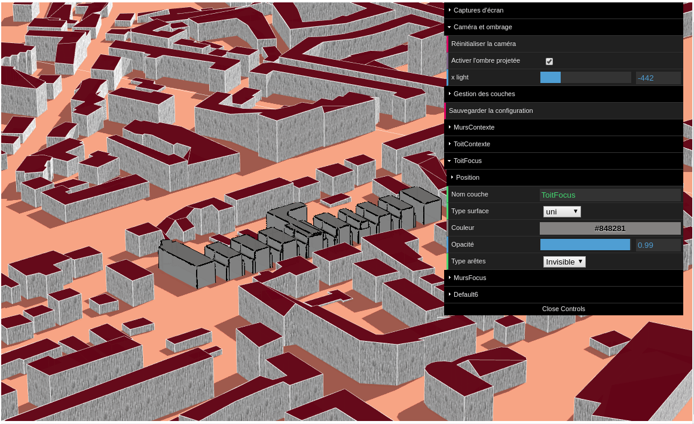

The goal of this analysis is to find out how the following things can be done :

* Loading an OBJ file.
* Applying a style to a mesh.
* Changing this style dynamically using a user interface (dat.GUI).

#### Description of the project

The project consists in a webpage which display a 3D scene that contains a plane geometry with building on it, and a user menu made with dat.GUI to change the visual aspect of the buildings (color, opacity, style...) and do some other actions, such as recenter the camera, save the current style, etc.  

There are two sorts of buildings :
* **Focus** : the main buildings the user wants to work on, loaded from an OBJ model.
* **Context** : the surrounding buildings, loaded from BDTOPO or BATI3D (also OBJ models).  

[Presentation of PLU++](http://ignf.github.io/PLU2PLUS/)

#### Structure of the code

The main code is divided into 5 files, as follow :

* **rendu.html** : contains the main work.
* **fonctions_gui.js** : contains main functions for file loading, GUI initialization and update.
* **fonctions_load.js** : contains the utils functions to load 3D files.
* **fonctions_sliders.js** : contains the utils functions to handle the sliders.
* **fonctions.js** : contains other utils functions

#### How does it work ?

1. The user chooses a JSON file as an input, to define the initial style.
2. The GUI is created with those initial parameters.  
(the style - discret, typique, sketchy - determines which parameters of the GUI are visible).
3. Three.js materials are initialized with the initial parameters.
4. Event listeners are created on the GUI : each change will be repercuted directly on the materials previously created (for the context) or on each vertice created (for the focus).
5. OBJ models are loaded with the current material.

#### Possible ameliorations

Although the PLU++ project successes in creating an easy-to-use interface to dynamically change the stylization of 3D objects through various parameters, its implementation has some limitations. Particularly, its structure does not clearly separate the 3D geometry and the stylization itself.

However, it provides a helpful set of functions that can be re-use in our project, particularly for edges extraction and texture application.

Therefore, the idea of our project is to re-make the concept of PLU++ inside the iTowns structure, but in a more generic way so it can be re-used and re-adapted more easily.

### Definition of a style

The definition of the term style depends on the field of research.
In cartography, the term style is defined by an identification of visual characteristics on a map. The style is a way to show different types of render. The result can be shown in 3D thanks to the position of a virtual camera and light sources. A material is attribute to each object to determinate the appearance in the final render.

#### Visual variables on cartographic representation

In the book "Semiologie Graphique" written by Jacques Bretin in 1967, the style is defined as a graphical traduction of an information.
The author describe, in his book, visual variables as the ways to manage the symbology of the 3D object on the scene.
Bertin defined seven initial variables :  **position**, **size**, **shape**, **orientation**, **color hue**, **color value** and **texture**. These variables can help the viewer to have a simple idea of how the object is represented in a map.
It is why they will to be included in the project to manage the style of 3D object.

#### 3D Buildings stylization

In the iTowns project, the buildings style is described as a photo-realistic representation. The 3D object will look like as well as possible to the reality.
The goal of the VIBES project is to modify the style of building and show them as an abstract representation. The abstract representation can be describe with different 'generic' styles :

 * **Discret** : this style presente very fine or dashed lines and transparency.
 * **Typical** : this style is similar to the hues of real buildings with characteristic elements like door, windows or chimney. It looks like photo-realistic style.  
 * **Sketchy** : this style represente buildings as if they were drawn with pastel and bright colors. 

These 'generic' styles were described by Anouk Vinesse in the PLU++ project.


**[Back to the top](#summary)**


## Conception and development

### Style format

In order to save and re-use the style of an object, we need to find a way to store this information so it can be accessed easily. The obvious solution, in a JavaScript project, is JSON.  

The next question is : what do we stylize ? Does the stylization concern a single mesh, or a complex object with several styles at once ? A concertation with the client led us to implement both alternatives. Two stylization methods will be created :

(schema explicatif)

Therefore, there will also be two types of style formats :

* Generic style, applicable to any mesh :

```json
{  
   "edges":{  
      "opacity":1,
      "color":"#ed0606",
      "width":2.525429673798667,
      "style":"Dashed",
      "dashSize":0.2877972641178534,
      "gapSize":0.05
   },
   "faces":[  
      {  
         "opacity":1,
         "color":"#dadeda",
         "emissive":"#938383",
         "specular":"#111111",
         "shininess":67.34479130129779,
         "texture":"./textures/bricks.jpg",
         "textureRepeat":0.374991231146966
      }
   ]
}
```

* Style format for a complex object with several meshes, all defined by a name :

```json
{
  "edges": {
    "opacity": 1,
    "color": "#000000",
    "width": 0.5050859347597334,
    "style": "Continuous"
  },
  "faces": [
     {
      "name": "Tower1_Tower",
      "opacity": 1,
      "color": "#a06b6b",
      "emissive": "#614848",
      "specular": "#111111",
      "shininess": 31.55357142857143,
      "texture": "./textures/bricks.jpg",
      "textureRepeat": 0.1
    },
    {
      "name": "Tower1_window",
      "opacity": 1,
      "color": "#ffffff",
      "emissive": "#d4a9a9",
      "specular": "#f2dbdb",
      "shininess": 30,
      "texture": "./textures/glass.png",
      "textureRepeat": 1.5901250000000002
    },
    {
      "name": "Tower1_Tower_Fence_posts_Tube_1",
      "opacity": 1,
      "color": "#ffffff",
      "emissive": "#000000",
      "specular": "#111111",
      "shininess": 30,
      "texture": null,
      "textureRepeat": null
    },
    {
      "name": "Tower1_Tower_Fence_posts_Tube_2",
      "opacity": 1,
      "color": "#ffffff",
      "emissive": "#000000",
      "specular": "#111111",
      "shininess": 30,
      "texture": null,
      "textureRepeat": null
    } 
  ]
}
```

TODO : update style format

### 3D stylization process

The 3D stylization will be done according to the following activity diagram :

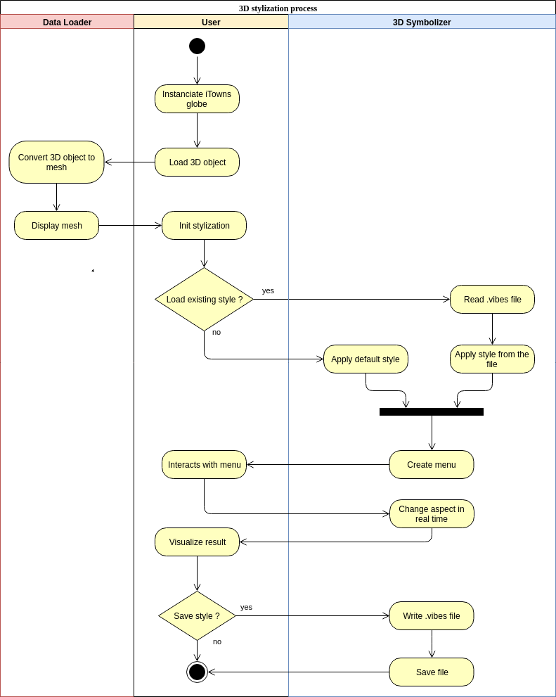 

### Architecture

#### Global architecture  

The architecture of our project must be included in iTowns. The following schema shows the different functionalities of iTowns, with the ones that interest us in red :  

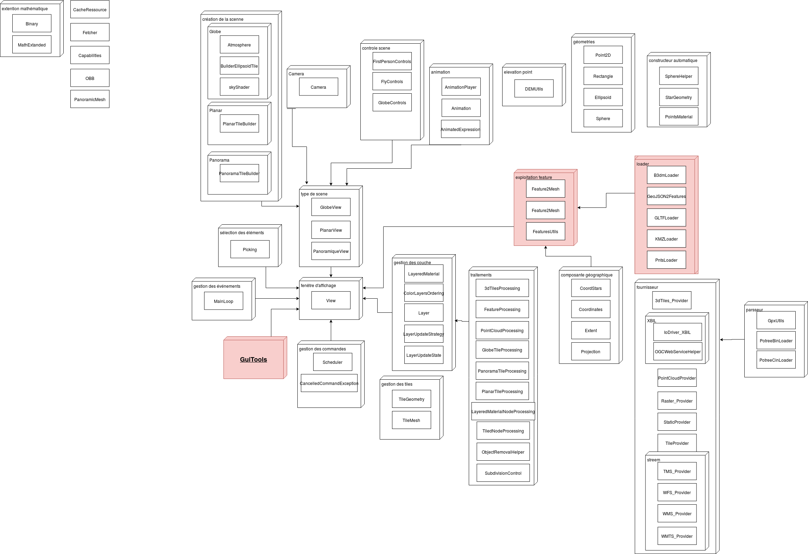

*<p align="center">legend : iTowns architecture (version du 5/03/2018).</p>*

The goal is to make this tool as general as possible, which means it must not depend on just one example. On the contrary, it should be usable on any example containing a 3D object on an instance of the globe, as a full-fledged functionality of iTowns. Therefore, we created a new class Symbolizer, which manages the 3D render. We also extended the loading functionalities of iTowns in order to handle .obj files and other formats, using a new class called ModelLoader. These two classes are called by an other class called LayerManager. 

The final architecture of our project is the following :

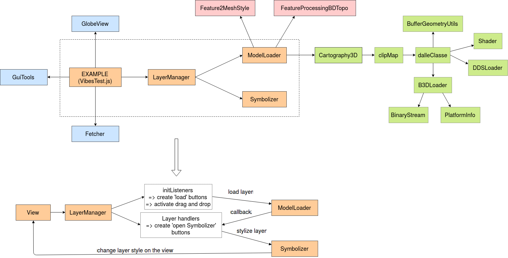 

The classes in orange are the ones we created from scratch.  
The classes in blue are the iTowns classes we re-used directly  
The classes in pink are iTowns classes we duplicated to make some slight modifications. (see [BDTopo](#BDTOPO-loader) for more details).  
The classes in green are classes from iTowns-legacy we re-used to load BATI3D (see [Bati3D](#BATI3D-loader) for more details).  

 

#### Classes

The core of our project are the 3 classes and the example represented in orange :  

* **ModelLoader.js** : the class to loads different sort of 3D objects (just *.OBJ* for now).

* **Symbolizer.js** : the class that carries all the stylization functionalities.

* **LayerManager.js** : the class that manages the user interface.

* **VibesTest.js** : the example file (linked to the HTML document) where we call the previous classes.


This schema describes the links between these classes :

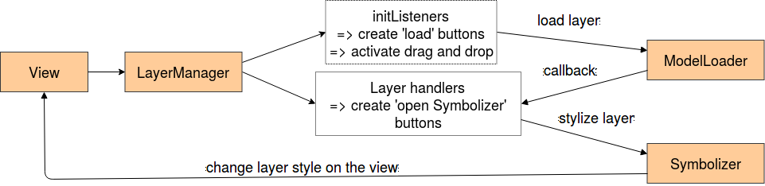 

* The LayerManager is instanciated in the exemple.  

* The LayerManager initialize event listeners : 2 buttons on the GUI (to load BD Topo and BATI3D), and a drag and drop listener (to load OBJs).  

* When one of these listeners is trigerred, ModelLoader is called (*'load layer'* arrow).  

* After the layer is loaded, it appears on the view and the LayerManager *handles* it (*'callback'* arrow). This means that the layer is added to a list of checkboxes, and buttons to activate the Symbolizer are created : the layer is ready to be stylized.  

* When the user activates the Symbolizer (*'stylize layer'* arrow), the stylization controllers appear on the GUI, which allows the user to modify the visual aspect of the object.  

* Stylization changes are displayed in the view.  


##### Class ModelLoader  

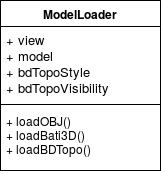  

This class has 2 attributes :
* **The iTowns view**
* **The object to load** : the model that carries the object loaded and the edges extracted from it (see [after](#edges-extraction)), and special attributes to handle BD Topo.

It contains one public method for each format : **loadOBJ()**, **loadBATI3D()**, and **loadBDTopo()**.  

These functions convert the 3D object into a group of meshes adapted to the symbolizer, and call internal methods to load the object in iTowns. The final object (and its edges) are stored in the attribute *model*, except the tiles from BD Topo, which are handled differently.  

  

##### Class Symbolizer

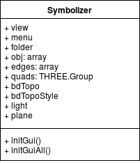  

This class has the following attributes :  
* **The iTowns view**
* **Attributes related to the GUI management** : the menu and the Symbolizer folder.
* **The objects to stylize** : the object itself (a list containg a group of *THREE.Mesh* for each layer), the edges, the possible quads (useful for the sketchy stylization), and special attributes for the stylization of  the BD Topo extruded features.
* **Attributes related to the environment ** : the light and a plane to receive the shadows.

To initialize the Symbolizer, the user needs to call either initGui() or initGuiAll(). The operation of these methods is explained with more details [here](#general-functioning-of-the-symbolizer).

  

##### Class LayerManager

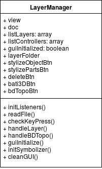  

The ModelLoader and the Symbolizer could suffice to perform a stylization on an object. However, it is desirable to apply the same stylization on several objects. This is the interest of the LayerManager : providing an interface similar to those we can find in a GIS, so the user can manipulate his layers.

  

The methods of this class manage the elements of the GUI and the event listeners, as described [here](#user-interaction-with-layers).

This class also allows to move the loaded object using check keys, as described [here](#geolocation).​  

​  

**[Back to the top](#summary)**

## Results

### Functionalities implemented

#### Basic functionalities

The first version of our tool was first based on the iTowns example "collada". It is located on a new example called "VibesObj". To try it, simply run this example on our fork of iTowns, available at [this adress](https://github.com/arnaudgregoire/itowns-style), or try it online [here](https://github.com/itownsResearch/2018_TSI_vibes).

##### Loading a 3D object in iTowns

The first step to stylize a 3D object is to load this object and make it visible. We focused on the .OBJ format at the beginning, as we already had samples for testing. We used the Three.js extension *OBJLoader*, already included in iTowns in the node module three-obj-loader ([source](https://github.com/sohamkamani/three-object-loader)).  

To load a 3D object in iTowns, we have to follow the following steps :
* Instanciate the globe.
* Instanciate the OBJLoader and call the load function.  

The following steps are implemented in the callback of the load function.
* Place the object on its right location, rotate and scale it if necessary.
* Put the object layer in the camera layers so it is rendered.
* Initialize a material and assign it to the object.
* Update the transformation (with updateMatrixWorld()).
* Add the object to the scene.
* Notify the change to the globe view.

The loaded object should now appear on the globe at the chosen position. We chose to first display it with a *THREE.MeshPhongMaterial*, with these parameters :
* **color: #ffffff**
* **transparent: true**
* **side: THREE.DoubleSide**
* **castShadow: true**

We implemented a drag and drop functionality to easily load the 3D object (on .obj format), with a fixed geolocation for now. The example models are located in examples/model. We have been using croutitower.obj, test.obj and destroyer.obj for our first tests.

(image croutitower)

##### Applying a style to a mesh with Three.js

To change the stylization of an object, we must know how this object is structured and where the information about its aspect is stored.  

The objects we just loaded are actually a group of meshes (type *THREE.Group*). For example, the croutitower is composed of 14 meshes. We can access these meshes by iterating over the children of the object. Then we just have to access the attribute *material* of each mesh and change the attributes we want to change.  

The basic implemented parameters are : **color**, **opacity**, **emissive color**, **specular color**, and **shininess**.

##### Creating a user interface to dynamically modify the stylization

The Javascript library [dat.GUI](https://github.com/dataarts/dat.gui) allows to create a user simple interface with buttons, sliders, checkboxes, etc. It is already used in iTowns, in the GuiTools class, to handle color and elevation layers on the globe. Thus, we will re-use this menu and add our own stylization parameters on it. Each element of the menu has an event listener with a callback function that performs the corresponding stylization on the mesh.  

(TODO : add image menu dat.GUI basic stylization)  

##### Saving and loading a style

Our tool must also allow to save the current style in a *.vibes* file (see [above](#style-format)) and re-load it later. We used at first we use a npm package function but after [problems with the test](#continuous-integration) we use a home made fonction to save the file as a Blob object.   

We used the Javascript object *FileReader* to load a file and get the data in it. This data can then be parsed in JSON and read directly to be applied to the meshes.  
When a stylesheet is loaded, the values of the GUI are updated to match the current stylisation of the object.

**[Back to the top](#summary)**  

#### Advanced functionalities

##### Layer Management

###### User interaction with layers

Add a layer ? (d&d ou click pour BDTOPO / BATI3D) => the layer appears on the list
Select a layer (click or check)

When one layer (or more) is checked, three buttons appear :
* **Stylize object** : open a symbolizer to stylize all the meshes of the objects at once.
* **Stylize parts** : open a symbolizer to stylize the meshes of the objects independently (the objects must have the same number of meshes).
* **Delete layers** : delete the objects.

These buttons disappear when there is no more layers checked (if they are all unchecked or deleted).

The following figure shows the sequence diagram for displaying the Symbolizer.

<p align="center"> 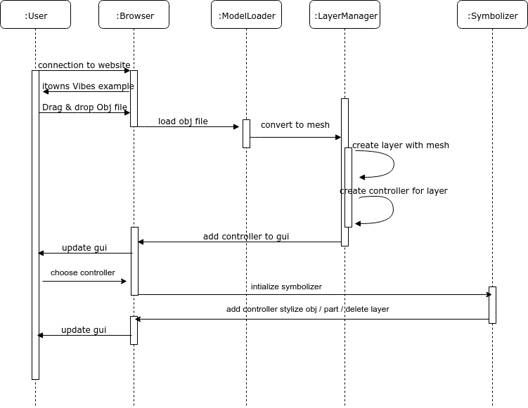</p>

*<p align="center">legend : sequence diagram for viewing the Symbolizer.</p>*

While the following figure shows us the user's interaction with the Symbolizer.

<p align="center"> 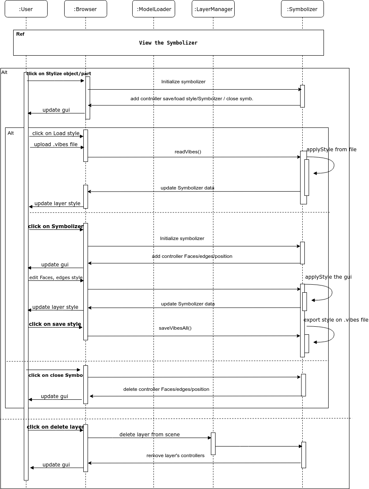</p>

*<p align="center">legend : sequence diagram for interaction with the Symbolizer.</p>*


###### Geolocation

An important issue concerning the layers is how to **geolocalize** them. This is easy when the data itself is georeferenced, but formats like .OBJ do not provide this information. Therefore, in this case, the user should tell where the object is located, but the question is how.  

The answer to this issue is twofold :
* The user should be able to enter (somehow) the parameters to locate the object he wants to stylize.
* He also should be able to adjust the position he chose (slight translations, rotations, scaling) later.  

* **Adjustments and relative positionning**

There are two ways to move objects:

The first one can be done by using the keyboard keys after clicking on the object or selecting it from the GUI, the user can use the follown keys:

* Keys a and z or 4 and 6 to move the object from West to East.
* Keys q and s or 8 and 2 to move the object from North to South.
* Keys w and x or 7 and 3 to move the object from Top-Down.

The second way the user can use the sliders on the GUI which are shown in the picture below : Translate X, Translate Y and Translate Z

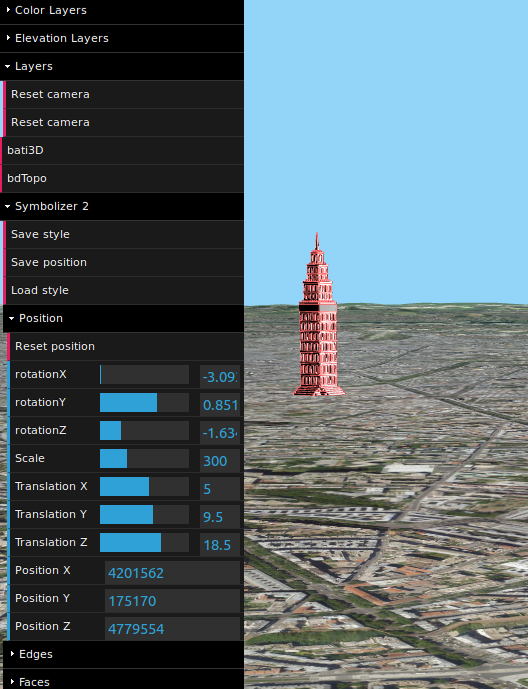

* **Absolute positionning**

But this method cannot be used to georeference an object completely - we cannot use a slider to move a mesh from one end of the world to the other. Until this step, the coordinates were hard-coded in the example, which is not satisfying.  

We could open a window for the user to enter the coordinates between the drag and drop and the actual loading of the object, but it seems pretty heavy. Plus, the user may not care about where the object is located, and just want to use the stylization tool.  

Therefore, we went for an intermediary solution, where a default position (on place de la Nation, Paris) is hard-coded, and the user can drag and drop a second file containing the necessary parameters to put the object at its right position (coordinates, rotations and scaling). The file looks like this :  

```json
{
    "name": "croutitower",
    "coordX": 2.396159,
    "coordY": 48.848264,
    "coordZ": 50,
    "rotateX": 0.5,
    "rotateY": 0,
    "rotateZ": 0,
    "scale": 300
}
```

It can be drag and dropped at any time, and will be applied to all the checked layers in the GUI.

##### Stylization  

###### General functioning of the symbolizer

The Symbolizer is the central class of Vibes, as it carries the concrete stylization functionalities.  
An object can be stylized in two ways : a global stylization, or a detailled stylization. In the second case, we stylize the object mesh by mesh, whereas in the first, we apply the same style everywhere. Therefore, there is two methods to initialize the Symbolizer :
* **initGuiAll** : opens one Symbolizer for all the meshes of the object.
* **initGui** : opens one Symbolizer for each mesh.  
  
The process of stylization in the Symbolizer works as follows :  

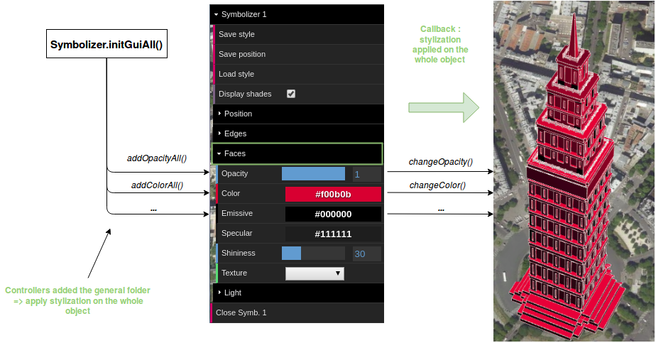

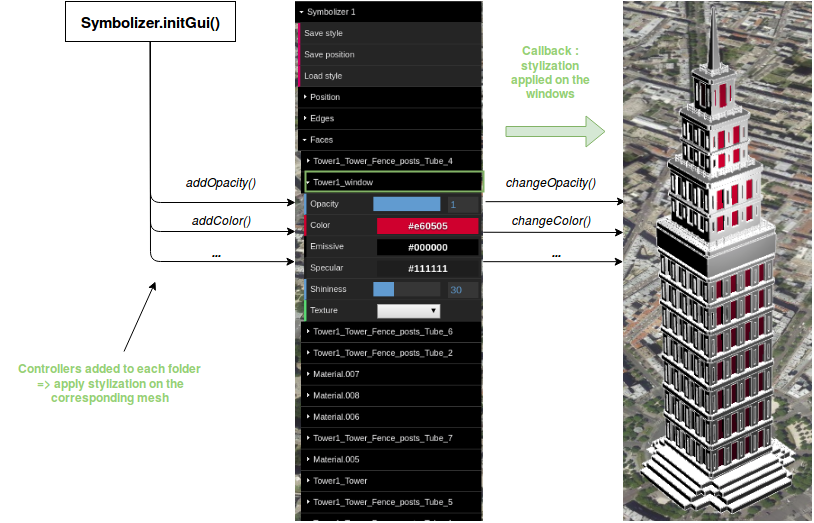  

Each initializer method builds the structure of the GUI, with the appropriate folders and add the controllers to it (buttons and sliders). These controllers all carry callback functions that perform the concrete stylization on the object or edges when they are triggered.  


###### Edge stylization

* **Edge extraction**  
  
The edges are extracted from the geometry thanks to a *THREE.EdgesGeometry* object, then converted into *THREE.LineSegments* and added to a group of lines that will be placed in the scene at the same coordinates as the object.  

These edges are initialized with a *THREE.LineBasicMaterial* that can be stylized the same way as the materials on the faces. However, unlike the faces, the edges can only be stylized as a whole, we did not separate them according to the mesh from where they were extracted.  

The parameters we can currently change are : **color**, **opacity**, **width**.
We also plan on adding a parameter to change the style of the edges (continuous or dotted line), but we faced a problem related to the Three.js library. Indeed, this parameter require a function of Three.js that was moved in the *THREE.Line* class in a later version than the one included in iTowns, and we could not make this function work at its previous location. This is one of the problem we need to solve in the next sprints.  

* **Simple parameters**
* **Dashed edges**
* **Sketchy edges**
  
An edge is a linear geometry, so we cannot simply apply a texture on it. A solution, based on Mathieu Bredif's work, has already been found in the PLU++ project. It consists in creating a quadrilateral where the edge is, and apply the texture to it. This rectangle should always be facing the camera so the edge is always visible.  

The implementation is in progress.  

(TODO: update + image exemple sketchy edge)

  

###### Face stylization

* **Simple parameters**
  
When the 3D object is loaded, it is converted to meshes. The material of these meshes are initialized with a *THREE.MeshPhongMaterial* object so they can be stylized using a Symbolizer.
The parameters which can be currently change are : **opacity**, **color**, **emissive**, **specular**, **shininess**.

* **Face texturation**
  
The PLU++ project allows to apply texture on the faces of the object, but also on the edges, in order to diversify the possible styles. The images we used as sample textures were taken from this project and from the croutitower example.  

Applying a texture on a face is rather easy : the *THREE.MeshPhongMaterial* has a 'map' parameter that can store a texture. We used *THREE.TextureLoader* to load an image from its local path and added the texture we obtained to the material.  

The source image must be located in the right folder in iTowns (*examples/textures*) and the name of the texture must appear in the *listeTexture.json*. The path of the texture is saved in the stylesheet.  

When a texture is applied, a new slider appears on the GUI to change the repetition of the texture.  

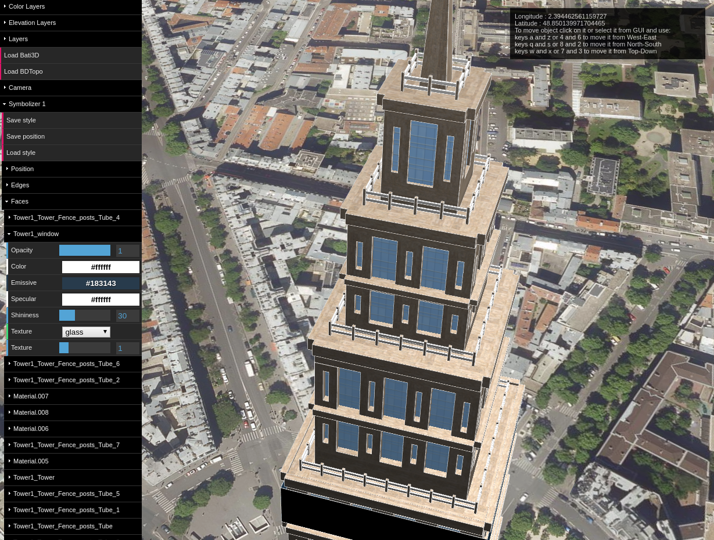


* **Shader application**
To allow the user to apply a more customized render, a next step could be the application of a shader in the faces of an object. This could be done the same way as we did to create sketchy edges, with the *THREE.ShaderMaterial*.  

Like for the texturation with the image, some default shaders would be located in a folder in iTowns, with a json file containg the lists of names, in order to make them appear in the GUI as a drop-down list. Then the user would be able to add its owns shaders.  

For each shader, three files would be required :

* The **vertex** shader : *ShaderName_vert.glsl*
* The **fragment** shader : *ShaderName_frag.glsl*
* A JSON file containg the **uniforms** : *ShaderName_uni.json*

 This functionality might be implemented in the last week of the project.


##### Environment

Customizing the stylization of the environment in iTowns is a little more challenging than the other parameters, as it implies acting on elements that are already implemented. Unlike PLU++, the environment is already set, so we cannot re-use the functions.

###### Lights

In order to make the integration of 3D mesh more realistic, we had a light located nearly above the building. Its a ThreeJS PointLight that gets emitted from a single point in all directions. We woud have prefered use a DirectionalLight like the one already implemented internally iniTowns but we never achieved to make it work.  The drawback of PointLight is that two identical object in the 3D scene located at different places will have different shadows.

  ```javascript
  var plight = new THREE.PointLight(0xffffff, 1, 0, 1);
  var coordLight = coord.clone(); // Building coordinates
  coordLight.setAltitude(coordLight.altitude() + 350);
  plight.position.copy(coordLight.as(this.view.referenceCrs).xyz());
  plight.position.y += 70;
  ```

Moreover, we had in the dat. gui a subfolder named "Light" which contain slider that are linked to light position (x,y,z) and color. For example, the user turn the light's scene to yellow and can move it to see shadow rotation. This can be a first approximation of a daylight.


###### Shadows

In a native iTowns application, there is no easy way to implement buildings shadow. In fact, iTowns modify the classic shadowmapping method, making it not usable for us. In order to create shadows of buildings on the ground, we create 2 objects :

- a  1x1km plan centered on building. This plan is made of ShadowMaterial. This particular Threejs material can receive shadows, but otherwise is completely transparent. We make it semi-transparent in order to have a nice shadow (less dark). Unfortunately, we had to disable the depthTest to make our shadow appear. According to our product owner Alexandre Devaux, its due to a bug internally to itowns. This lack of depthTest makes sometimes a visual bug where shadows will be put in front of the building.

  ```javascript
  var planeGeometry = new THREE.PlaneBufferGeometry(20, 20, 32, 32);
  var planeMaterial = new THREE.ShadowMaterial({ side: THREE.DoubleSide, depthTest: false });
  planeMaterial.transparent = true;
  planeMaterial.opacity = 0.5;
  var plane = new THREE.Mesh(planeGeometry, planeMaterial);
  ```

- The light decripted above.

Finally, we add  an option "Display shades" in our dat.gui to let to the user the choice of displaying our shadows. Here is a screenshot of one building with it shadow.

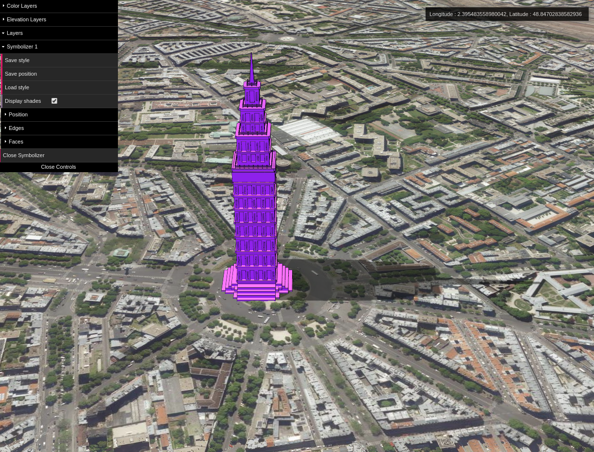

###### Camera

Once the question of geolocation was resolved, we had to manage the camera orientation.
In iTowns, some function can help to manage the camera. For instance, to follow the mouvement of the 3D object on the scene, a function is called when its coordinates change:

  ```javascript
  globeView.controls.setCameraTargetPosition(this.obj[0].position, false);
  ```

The same function is use when the object is load on the scene.

The position of the object became camera's position. This system is manage in the class Symbolizer.

Also, it is posible to modify the camera's coordinates and the zoom scale (parameters **Longitude**, **Latitude** and **Zoom**) and reinitialize the parameters with the menu.

In addition, different camera points of view are proposed : **oblique**, **immersive**, **globe**. 

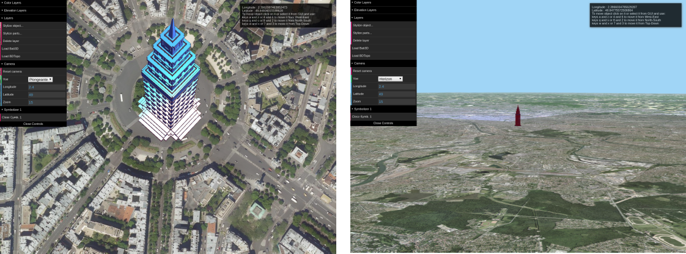

##### Loaders

We have three different loader for loads three types of object (.obj, the BATI3d and the BDTopo). 

###### OBJ Loader

The *'.obj'* is a standard for recording 3D objects. *three.js* have already a loader to convert *'.obj'* to THREE.Group.

We use the npm package *'three-obj-loader'* to load the *'.obj'* and we created a function for personalize them. So, we put it at the giving location, apply the giving rotation and scaling, create and apply the initial THREE.MeshPhongMaterial on the faces and extract the edges and initialize its style. Then, we manage the light and the shadow for the group. Finally, we add the light, the shadow, the faces and the edges to the scene and after use the giving callback function with the faces and the edges.

###### BATI3D Loader

The BATI3D is an IGN production that gives the 3D building of France by 500mx500m tile (in the localization where the data exists).

One tile match one folder whose name depend on the top left corner coordinates (ex:'EXPORT_1302-13722'). The 3D model is save as '.3DS' and link to the corresponding orthophoto images. The 3D model has each point geolocated with the *Lambert93* coordinates (EPSG:2154).

For load the IGN's BATI3D, we were guided by the iGN project : [*itowns-legacy*](https://github.com/iTowns/itowns-legacy) who has a sample of BATI3D and load it on an itowns plan view. 

The difficulty is to make the load work on the itowns glob view instead of the itowns plan view. Another difficulty is the points coordinates who is expressed in *Lambert93* and iTowns use only the Geocentric coordinate system *WGS84* (EPSG:4978) and the Geodetic coordinate system *WSG84* (EPSG:4326).

We reuse the classes: Cartography3D,  clipMap,  dalleClasse,  Shader, B3DLoader,  BinaryStream,  DDSLoader,  PlatformInfo and the function BufferGeometryUtils extracted from  Utils.

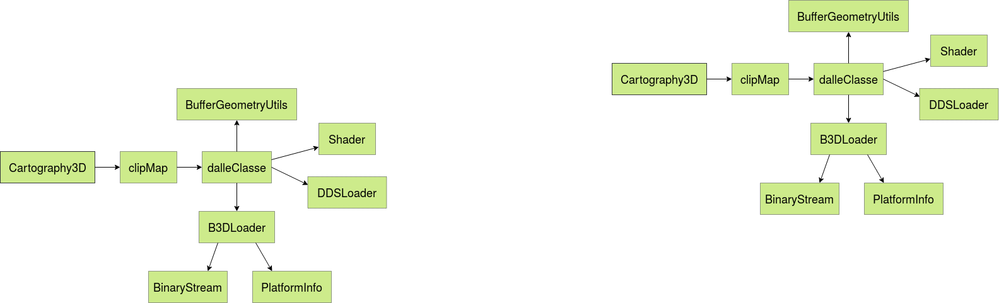  

* *Cartography3D* initialize the creation of the BATI3D object. We change the refocusing of the tile, the way of loading the tile who initially depend on the camera position and now it depends only on the area and the tile available.
* *clipMap* create the grid of all *dalleClasse* use. 
* *dalleClasse* (tileClass) load the BATI3D data with the B3DLoader, create the THREE.Group of faces with *BufferGeometryUtils*, extract the THREE.group of edges, put them the good material and add them on the scene.
* *B3DLoader* read the binary BATI3D data and extract all the information needed. 
* *BinaryStream*, *PlatformInfo* are used by *B3DLoader* to read the binary BATI3D data.
* *DSLoader* is used to read the orthophoto images (no use now).
* *BufferGeometryUtils* convert the information extract by the *B3DLoader* to a THREE.Group of THREE.BufferGeometry. We change the way of created the THREE.BufferGeometry : the coordinates (EPSG:2154) are convert to EPSG:4978, put in the order (x, y, z) and not to (x, z, y) and we add the 'normal' for the THREE.MeshPhongMaterial can be well applied. We use a THREE.MeshPhongMaterial for the faces and create the edges associated.

We have some problems with the orthophoto images application so we don't use it.

###### BD TOPO® Loader

The BD TOPO® is a *"3D vector description (structured in objects) of the elements of the territory and its infrastructures, of metric precision, exploitable on scales ranging from 1: 5 000 to 1: 50 000."* [source](http://professionnels.ign.fr/bdtopo). The BD TOPO® is accessible with a WFS flux and iTowns already use it on the [globe wfs extruded](http://www.itowns-project.org/itowns/examples/globe_wfs_extruded.html) to load the buildings.

We do the same as the [iTowns example](http://www.itowns-project.org/itowns/examples/globe_wfs_extruded.html), but we need to change the way to create the visible object and manage the layer.

We created a new class Feature2MeshStyle based on Feature2Mesh. We change the creation of the object, the roofs and the walls are separated, the edges are created and a THREE.MeshPhongMaterial is applied instead of a vertexColor. The parameters of the faces and edges material depend on the style object update by the *symbolizer*.

During the symbolization of the BD TOPO® we had some problems with the opacity of the walls, roofs and edges who is not apply on the buildings. The problem came from the update function *'FeatureProcessing.update'*  who make the mesh opacity equal to the Layer opacity. So, we created  *'FeatureProcessingBDTopo.update'* who don't change the mesh's customized parameters.

We use a flux to have the BD TOPO® so he is not put on the scene like the other objects so we created a function, *'ForBuildings'*, on the *ModelLoader* to access at the Mesh of each BD TOPO®'s tiles and can edit them. 


**[Back to the top](#summary)**


## Tests

### Unit tests

In order to write our unit tests we rely on the mocha framework which was used in the previous unit tests of Itowns project. This framework is a feature-rich JavaScript test that can be used for both Node.js and browser-based testing,it's
interfaces system such as BDD, TDD, Exports, QUnit and Require-style allows developers to choose their style of DSL.

In our project we choose to continue working with the BDD (Behavior Driven Development ) interface which provide a syntax including describe() , context(), it(), specify(), before(), after(), beforeEach(), and afterEach(), it focus on what the application should do, and on how it will do it.

As we mentioned above we continued working and adding some tests to the previous test folder of the Itowns project, a part of these unit tests run using the CLI (commande line interface) and the others need the browser to be executed since our application uses the Dom element,and the nodeJs server does not have access to the Dom,we had to run these kind of tests on the browser. to do that we made a simple HTML page which our test runner page (/mochaTest.html).
The page loads Mocha, the testing libraries and our test file(/tests/vibesObjTest.js) and finally to run the tests, we simply needed to open the runner in a browser.
the pictures below show the results of the test units:

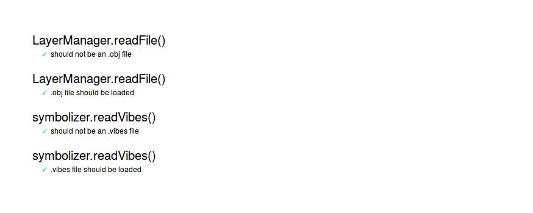
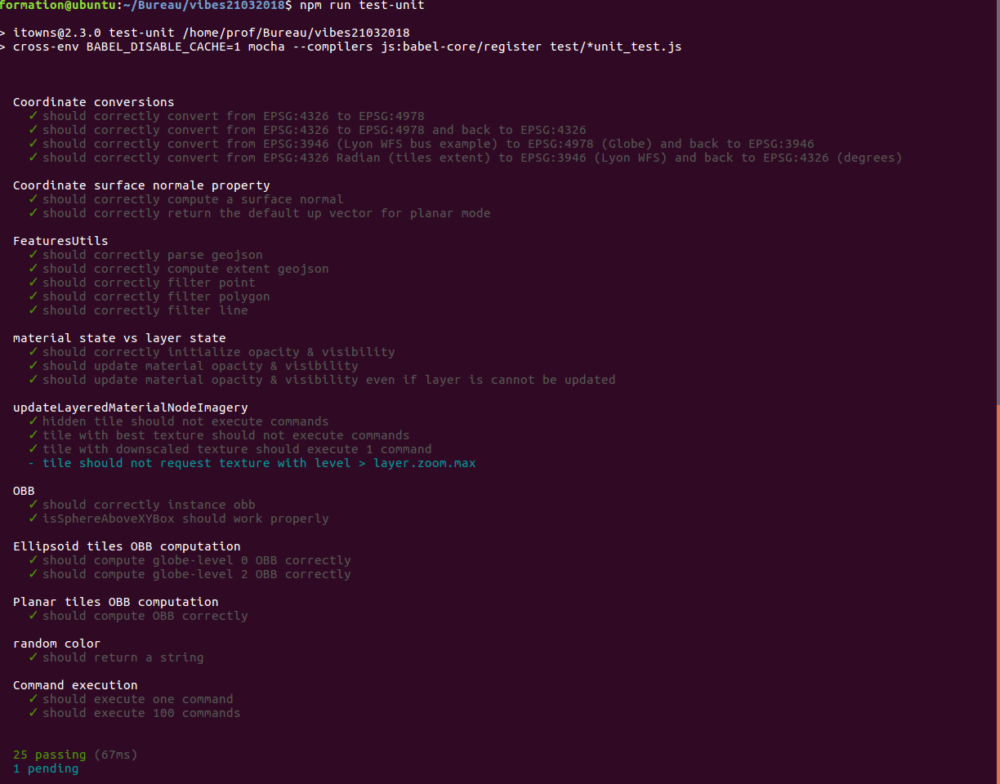

### Continuous Integration [](https://travis-ci.org/arnaudgregoire/vibes)

For run all the test we use [TravisCI](https://travis-ci.org/arnaudgregoire/vibes). The initial iTowns project use already TravisCI for the unit test and deploy it on its website. So we change the [*'.travis.yml'*](/.travis.yml) for do only the tests with ont the deployment. 

At the begining all work well, but after add the salving of style *.vibes* and position *.gibes* it fail.
We have some problems with the npm package for save the files, [*'file-saver'*](https://www.npmjs.com/package/file-saver), during the compilation of itowns on [*'itowns-testing.js'*](/test/itowns-testing.js#L113). We start to une an other package, [*'savery'*](https://www.npmjs.com/package/savery) but it have the same problem. So we use an other save function write on the example and give it to the *Symbolyzer*.

### Deployment

In this project we worked on the repository https://github.com/arnaudgregoire/vibes. Mathieu Bredif wanted to gather itowns examples on the repository https://github.com/itownsResearch. Thats why we created a second repository https://github.com/itownsResearch/2018_TSI_vibes which host the online version of vibes at https://itownsresearch.github.io/2018_TSI_vibes/examples/vibesObj.html.

In order to publish on our website a given version of vibes, we developped a publish script (./publish.sh at root folder) that follow the workflow decripted below : 

- First we force push the new version of arnaudgregoire/vibes on itownsresearch. By doing that, all files from itownsResearch/2018_TSI_vibes are replaced by arnaudgregoire/vibes files.

  ```sh	
  git push -f https://github.com/itownsResearch/2018_TSI_vibes master:master
  ```

- Then we clone a version of the itownsresearch repository. We install all the dependency and we build the dist folder which contain all builded javascript files. We will need those file in order to maintain our website without any node server, just pure html5.

  ```shell
  git clone https://github.com/itownsResearch/2018_TSI_vibes
  cd 2018_TSI_vibes
  npm install
  npm run build
  ```

- Once we built our application, we commit and push the js files contained in the dist folder. This way, this preserve a readeable tree of commit, preventing thousand lines of differences between javascript built files.

  ```sh
  git add -f dist/*.js
  git commit -m "dist"
  git push -f
  ```

**[Back to the top](#summary)**


## Conclusion


### General review

During 6 weeks,  we worked together with real efficiency. We achieved in all goals that were fixed by our backer Sidonie Christophe.  We left behind us a fully functionnal and documented repository (https://github.com/itownsResearch/2018_TSI_vibes) and an online demo at https://itownsresearch.github.io/2018_TSI_vibes/examples/vibesObj.html. We used a SCRUM way of development using most commonly used tools in professional world like Trello, Github or Travis. Moreover, we used all knowledges that we learnt this year, particulary in the field of Continuous integration and continuous deployment, design pattern, team management, Node & Javascript frontend and backend, 3D visualisation and above all itowns. That leads us today to thank all professors that oversees our year, making it great and giving us a real  technical background for our future work.

### Personal reviews

* **Houssem Adouni**
  
 ...
​    
* **El-Hadi Bouchaour**
  
 ...
​    
* **Arnaud Grégoire**
  
As a simple developper, i worked on threeJS mesh integration in iTowns. Moreover, i worked on shadows and lights in iTowns Scene. Furthermore i made the drag&drop and all interactions between computer system files and browsers. In addition to that, i made a sets of examples. Besides, i although make the continuous deployment on  https://itownsresearch.github.io/2018_TSI_vibes/ . 
​    
* **Rose Mathelier**

 ...
​    
* **Laurie Nino**
  
 ...
​    
* **Adel Ouhabi**
  
 ...
​    
* **Ludivine Schlegel**
  
 ...

 ### Limits and perspectives

Our teamworked together during this project in order to achieve the set objectives, wesucceeded in implementing of a various of functionalities and techniques ofbuildings stylization, and we almost reached all what was fixed as goals, howeverthere was some difficulties that we faced and encountered when developing ourproject. We can summarize them in the following points:

- the threejs version ...
- the shadow…
- ​
- The majority of the unit tests that we intended to run them on nodejs need access to the Dom element, but the nodeJs server does not have access to it, so we tried to run them on the browser.  


  

**[Back to the top](#summary)**


## Authors

* **Houssem Adouni**
* **El-Hadi Bouchaour**
* **Arnaud Grégoire**
* **Rose Mathelier**
* **Laurie Nino**
* **Adel Ouhabi**
* **Ludivine Schlegel**

## Project backers

* **Mathieu Bredif**
* **Sidonie Chistophe**
* **Alexandre Devaux**


**[Back to the top](#summary)**

```

```
