<p align="center"></p>

# Visualization in iTowns of Buildings Elegantly Stylized

[](https://travis-ci.org/arnaudgregoire/vibes)


## Summary

1. [Introduction](#introduction)
2. [How to install VIBES ?](#how-to-install-vibes)
3. [How to use VIBES ?](#how-to-use-vibes)
3. [How to develop with VIBES ?](#how-to-develop-with-vibes)


## Introduction

The VIBES (Visualization in iTowns of Buildings Elegantly Stylized) project consists in implementing geovisualisation techniques to stylize buildings on the platform iTowns. This project aims to provide a visual support for city planning, among other purposes.  

The user should be able to :
* Load one or several 3D file (of various formats).
* Transform its/their visual aspect(s) using a GUI.
* Save the current style in a JSON-like format (to be defined).
* Load an existing style to re-apply it, including predefined styles (transparent, typical, sketchy).  
  
This project was carried out by a team of seven students from the master TSI of ENSG (Ecole Nationale des Sciences Géographiques).  

It was proposed by Sidonie Christophe, from the COGIT laboratory (IGN), with Alexandre Devaux and Mathieu Bredif as technical support on iTowns.


## How to run VIBES

### Locally

* Clone and run this repository on localhost

  ```sh
  git clone https://github.com/arnaudgregoire/vibes.git
  cd vibes
  npm install
  npm start
  ```

  ​

* Go to example/VibesObj.html *(Vibes Style Visualisation)*

​

  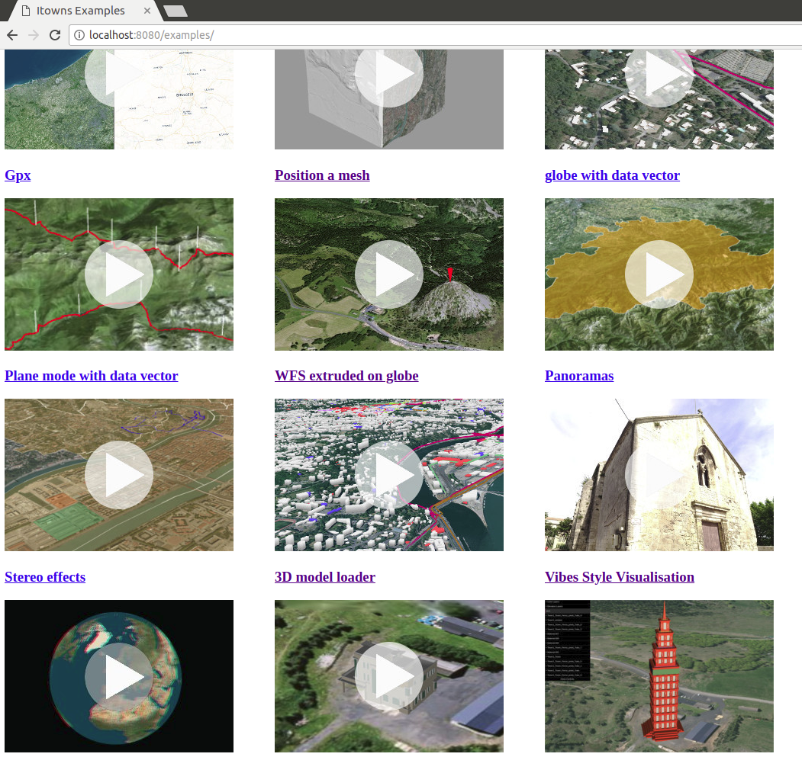

  ​

### Online

You can also try VIBES online [here](https://itownsresearch.github.io/2018_TSI_vibes/examples/vibesObj.html).


## How to use VIBES

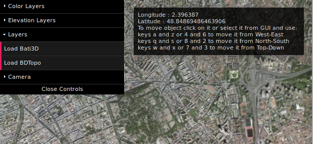

At first, VIBES displays the iTowns globe view and a GUI providing the following options :

* Load BD Topo
* Load BATI3D
* Some camera management functionalities


### Load an objet

The first thing to do is to load some 3D data to stylize.


#### Load BATI3D or BD Topo


To load data from BATI3D or BD Topo, you just need to click on the corresponding button on the GUI. 

* The 'Load BD Topo' button opens a WFS flow and loads the visible tiles.

  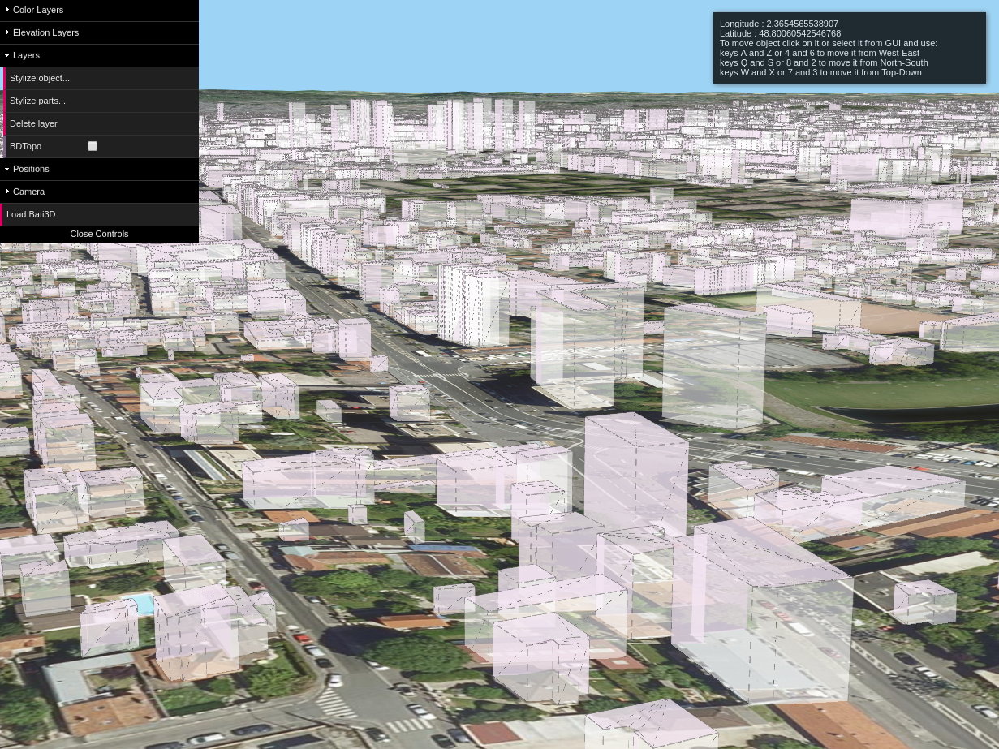

  ​

* The 'Load BATI3D' button loads the BATI3D files located in *'examples/models/Buildings3D'*

  

**/!\** To load your own BATI3D file, you must add it to the 'Buildings3D' folder. Therefore, you must run Vibes locally and put the whole BATI3D folder provided by IGN (without modifying the name).


#### Load an OBJ file

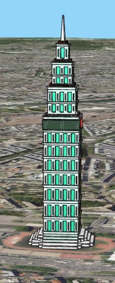

To load an OBJ file, just drag and drop it in the view. 

It may not appear right away : the default location is (0, 0, 0), so unless it has real coordinates, your object will probably be beneath the globe surface. 


### Geolocalize an objet

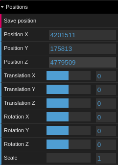

The OBJ format is not georeferenced, so you will probably need to geolocalize your object after loading it. 

First, select the layer you want to geolocalize. You can do this by clicking on it or by selecting it on the GUI.

Then you can move you layer, using one of the following methods :

* Enter the coordinates (X, Y, Z) directly on the GUI.
* Use the sliders Translation / Rotation / Scale.
* Use the following check keys : A/Z or 4/6 for a West/East movement, Q/S or 8/2 for a North/South movement, W/X or 7/3 for a Top/Down movement.

You can save your current location using the dedicated button on the GUI : this will download a .gibes file, a json-like file containg the coordinates and parameters of rotation and scale.

```json
{
    "name": "croutitower",
    "coordX": 2.396159,
    "coordY": 48.848264,
    "coordZ": 50,
    "rotateX": 0.5,
    "rotateY": 0,
    "rotateZ": 0,
    "scale": 300
}
```
To reload a location file, select the layer and drag and drop the .gibes file.


### Stylize an object


#### Apply my own style

When you select one or several layer(s), you can choose between two stylization options :

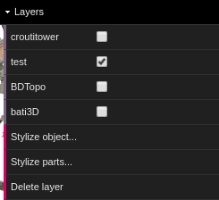

These buttons open two different Symbolizers : 

* **'Stylize parts'** performs a stylization mesh by mesh.


* **'Stylize objet'** stylizes the object as a whole.


Both Symbolizers provide the following functionnalities :

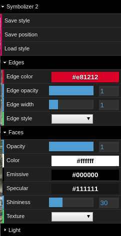

Let's take a closer look to some advanced functionalities :


##### Face texturation


VIBES allows you to apply a texture on one or several faces of an object. You just need to choose the texture you want among the list of default textures :

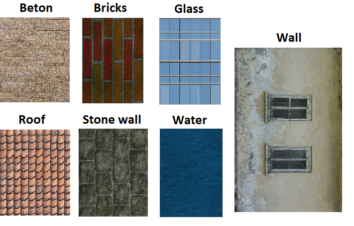

To add your own textures, you must have VIBES running locally : 

* Add the image to *examples/textures*.
* Add its name and its path to *listeTextures.json* (in the same folder) so it appears on the GUI.

You can now apply your own texture to your object !

After the texture is applied, a new slider appears, so you can change the repetition of the texture.

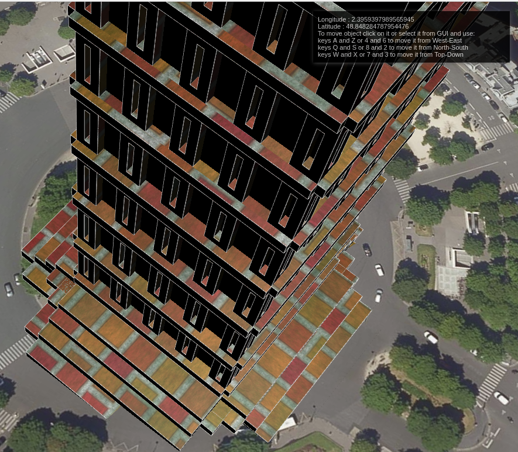

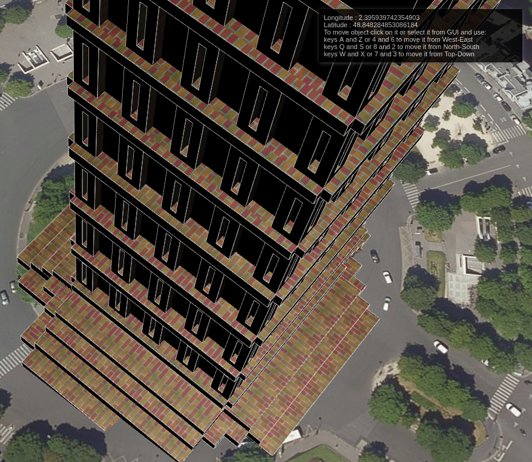


##### Edge style

You can choose between three types of edges :

* **Continuous** : the default type.
* **Dashed** :


This creates a *LineDashedMaterial*. 

When you apply dashed edges, two new sliders appear :

* *Dash Size* : defines the size of the dashes.
* *Gap Size* : defines the size of the spaces between the dashes.


* **Sketchy** :

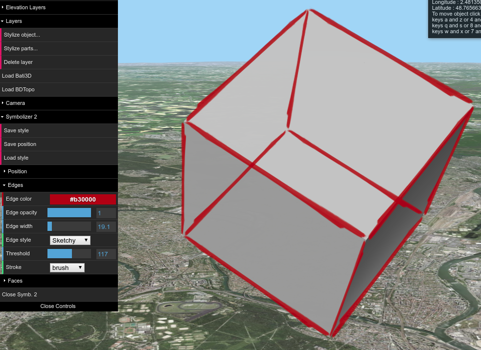

The sketchy style is made to create a cartoon-like stylization by appliying a stroke texture on the edges. As textures cannot be applied directly on a line, we apply them on rectangles created from the edges so they always face the camera.

The available strokes are the following :

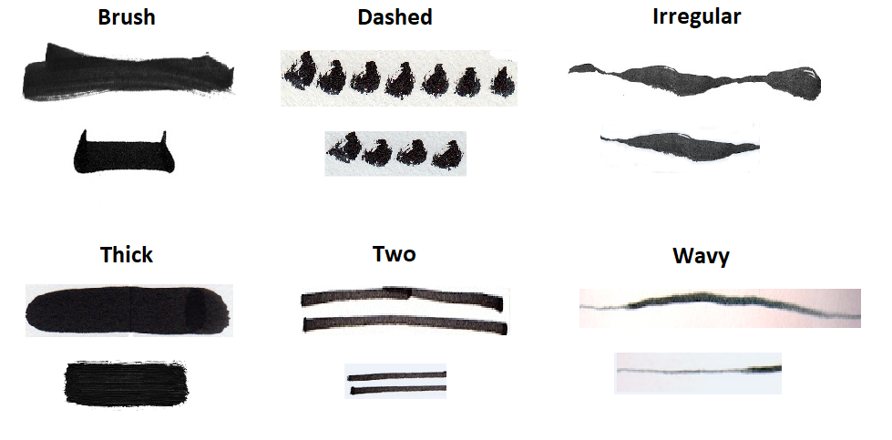

The 'small' strokes are applied to the edges that are smaller than the threshold size (that can be changed on the GUI).

When you apply this edge style, the opacity slider becomes ineffective, as the shader do not take this parameter into account.


#### Saving my style

When your stylization is done, you can save the style in a .vibes folder, also a json-like file containing all your parameters. 

* Generic style, applicable to any mesh :

```json
{  
   "edges":{  
      "opacity":1,
      "color":"#ed0606",
      "width":2.525429673798667,
      "style":"Dashed",
      "dashSize":0.2877972641178534,
      "gapSize":0.05
   },
   "faces":[  
      {  
         "opacity":1,
         "color":"#dadeda",
         "emissive":"#938383",
         "specular":"#111111",
         "shininess":67.34479130129779,
         "texture":"./textures/bricks.jpg",
         "textureRepeat":0.374991231146966
      }
   ]
}
```

* Style format for a complex object with several meshes, all defined by a name :

```json
{
  "edges": {
    "opacity": 1,
    "color": "#000000",
    "width": 0.5050859347597334,
    "style": "Continuous"
  },
  "faces": [
     {
      "name": "Tower1_Tower",
      "opacity": 1,
      "color": "#a06b6b",
      "emissive": "#614848",
      "specular": "#111111",
      "shininess": 31.55357142857143,
      "texture": "./textures/bricks.jpg",
      "textureRepeat": 0.1
    },
    {
      "name": "Tower1_window",
      "opacity": 1,
      "color": "#ffffff",
      "emissive": "#d4a9a9",
      "specular": "#f2dbdb",
      "shininess": 30,
      "texture": "./textures/glass.png",
      "textureRepeat": 1.5901250000000002
    }
  ]
}
```


#### Load an existing style

A .vibes stylesheet can be reloaded :

* With the 'Load style button'.
* By dropping it in the view if the Symbolizer is closed and the layer is selected.

VIBES already provide a few predefined styles : 

(images styles existants - à faire)

You can also load the MTL file corresponding to your OBJ, using the dedicated button.


### Stylize the environment

VIBES also allows you to personalize the environment around your object.


#### Lights and shadows

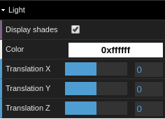

When an object is created, a point light is also created slightly above it. You can apply a translation on this light and change its color.


#### Camera

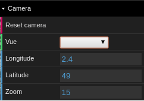

By default, the camera is set to follow the object's location. But you can change the position of the camera or the zoom by entering them on the GUI.

VIBES also provides three different point of views : **horizon**, **bird's eye view**, and **globe**. 


## How to develop with VIBES

VIBES can also bu used in your own iTowns application.

You can find the documentation here (add link to generated doc).


### Load an object

```javascript
var loader = new ModelLoader(view);
```

**Parameters :**

* **view** : the current view (globeView in our example).


#### OBJ

```javascript
loader.loadOBJ(url, coord, rotateX, rotateY, rotateZ, scale, callback, menu);
```

Loads the OBJ file from the url, places it at the given location, applies the transformations and execute the callback function.

**Parameters :**

* **url** : the URL where the OBJ file is located
* **coords** : the coordinates where the model should be placed
* **rotateX**, **rotateY**, **rotateZ** and **scale** : the parameters of the transformation to apply.
* **callback** : the function to be executed after the object is loaded.
* **menu** (optional) : the GUI (in VIBES, we pass it as parameter in the callback function).

When the object is loaded, a **model** is created, a JavaScript array containing the object itself (as a group of *THREE.Mesh*) and the edges extracted from it (a group of *THREE.LineSegments*). This model is passed as parameter of the callback function.


#### BATI3D

```javascript
loader.loadBati3D() ;
```

Loads the BATI3D data available in the folder *'examples/models/Buildings3D'*.

The data must be presented as the export folder from IGN and must not have been renamed (as the name is used to determine the location).

When the data is loaded, it is accessible in **loader.model**, as a JavaScript array with the object and the edges (same as OBJ).


#### BD Topo

```javascript
loader.loadBDTopo();
```

Loads the BD Topo tiles of the visible zone.

BD Topo is accessed through a WFS service, it is reloaded when we move to a new zone. Therefore, it has to be handled a little differently than simple object files.

When loaded, the BDTopo can be accessed this way :

```javascript
var bdTopo = _this.view._layers[0]._attachedLayers.filter(b => b.id == 'WFS Buildings');
```


### Stylize an object

```javascript
var symbolizer = new Symbolizer(view, obj, edges, menu, nb, light, plane, saveDataInit, bdTopo);
```

**Parameters : **

* **view** : the current view (globeView in our example).

* **obj** : an array containing the objects to stylize.

* **edges** : an array containing the edges extracted from the objects.

  **obj** and **edges** are mandatory : even if you only stylize data from BD Topo, you must set them as empty arrays.

* **menu** : a *dat.GUI* menu where the controllers will be added.

* **nb** : the number of the Symbolizer to be displayed on the GUI.

* **light** : the *THREE.Light* to stylize.

* **plane** : a *THREE.Plane* to cast the shadow.

* **saveDataInit** : a function to save files.

  Because of unsolved problems related to the CI, we came out with this temporary solution to allow instead of using a tool such as *FileSaver* or *Savery*. Until these problems are solved, the function to save files must be written in the example and passed in the Symbolizer as parameter. 

  You can add the following code before calling the Symbolizer :

  ```javascript
  function saveDataInit() {
      var a = document.createElement('a');
      document.body.appendChild(a);
      a.style = 'display: none';
      return function saveData(data, fileName) {
          var json = JSON.stringify(data);
          var blob = new Blob([json], { type: 'text/plain;charset=utf-8' });
          var url = window.URL.createObjectURL(blob);
          a.href = url;
          a.download = fileName;
          a.click();
          window.URL.revokeObjectURL(url);
      };
  };
  ```

  ​

* **bdTopo** (optional) : the *ModelLoader* object if you stylize BD Topo data.

  We need the loader here because in the case of BD Topo, we must update the style in the loader so the new tiles are loaded with the current style instead of the default one.

  ​

**Public methods :**

After instanciating the Symbolizer, you can call one of the following public methods :

* Open the interface of stylization :

```javascript
symbolizer.initGui();
// OR
symbolizer.initGuiAll();
```

These methods initiates the interface of stylization by creating controllers in the menu. These controllers will act either on each mesh of the objects or in the objects as a whole. (more details [here](#apply-my-own-style))

* Applying a style from a file :

```javascript
symbolizer.applyStyle(json);
```

This method applies the style of the given .vibes file on the objects and edges. The stylesheet must be a standard .vibes format (see [here](#saving-my-style)), and the parts of the object must correspond to the names in the file in the case of a stylesheet with several faces.


## Authors

* **Houssem Adouni**
* **El-Hadi Bouchaour**
* **Arnaud Grégoire**
* **Rose Mathelier**
* **Laurie Nino**
* **Adel Ouhabi**
* **Ludivine Schlegel**
